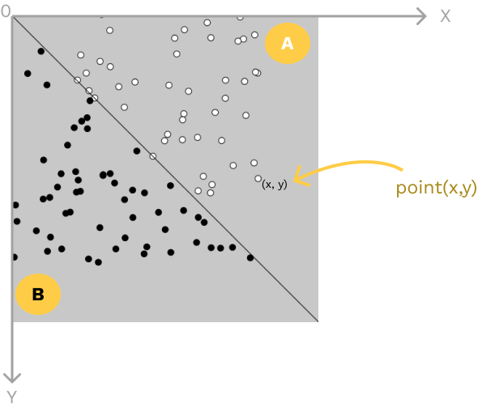
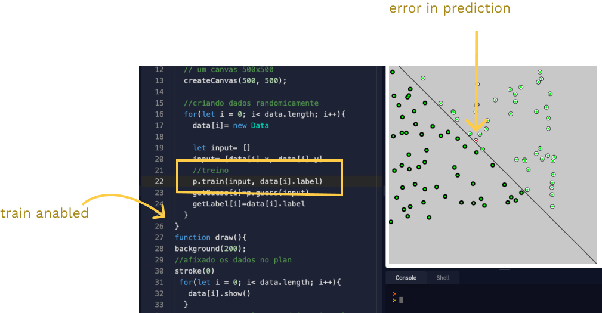
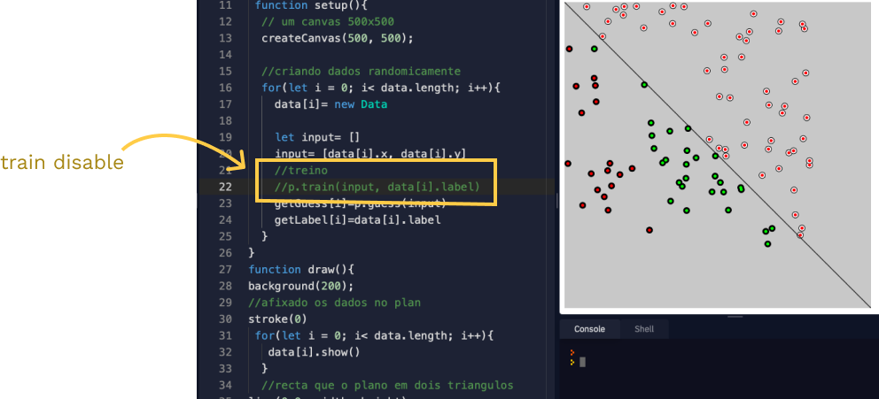

# single layer perceptron 

using js i trained a single layer perceptron.  a perceptron is also the most simple neural network model there is 

the code here do a **guess** for each input point **where they belong, if it's zone A or zone B** and then if the prediction is rigth then the point gets colerd green 🟢 if not the point  gets colored red 🔴.

* the tows zones are separeted by a line as you can see :

int the next image i deseable tre trainning...the neural network(the percepton) make a guess without train:

you see how wrong he can predict with no ajustement:

but here i anable the train, and our preception shows much more able to predict the rigth guess, but still make a few errors

* to visualize the data i used P5js a js library that uses canvas for draw in html,

🤩special thanks for "the coding train" for their marvelous neural network playlist on youtube

